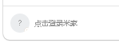
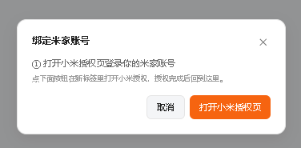
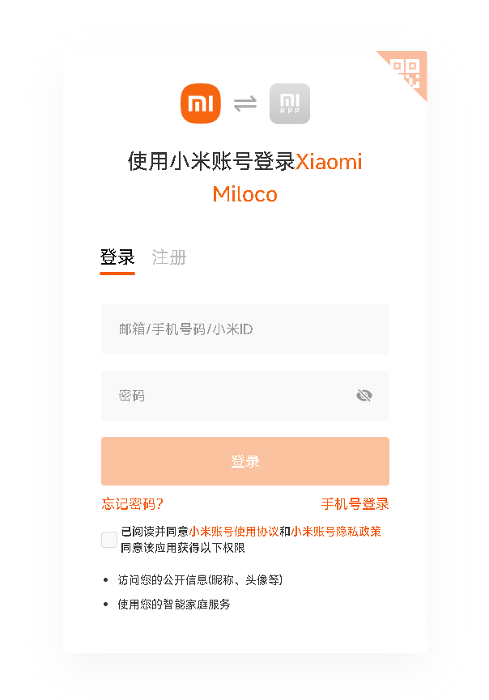

# Nekro Miloco

Nekro Miloco 是一个 NekroAgent 插件，用来连接已经部署好的 miloco 后端，让 Agent 控制小米智能家居、查询家庭/房间/设备/场景、接收 miloco 感知事件，并在用户明确要求时发送事件片段。

## 许可证

本项目使用自定义非商业强制开源许可证，详见 [LICENSE](./LICENSE)。

核心要求：

```text
不得商用。
使用本项目任何部分源码，或基于本项目产生任何延伸作品，无论是否修改，整体都必须按 AGPL-3.0 开源。
通过网络、API、机器人、插件、网页、后台服务或容器镜像向他人提供功能，也视为使用和分发。
使用者还必须遵守 LICENSE 中的反 996 条款。
```

`xiaomi-miloco` 参考内容同时遵循 LICENSE 中附带的 Xiaomi Miloco 许可证。

## 1. 部署 miloco 后端

使用已经构建好的镜像：

```powershell
docker rm -f miloco

docker run -d `
  --name miloco `
  --restart unless-stopped `
  -p 1810:1810 `
  -e MILOCO_SUPERVISED=1 `
  -e MILOCO_HOME=/data/miloco `
  -e MILOCO_SERVER__HOST=0.0.0.0 `
  -e MILOCO_SERVER__PORT=1810 `
  -e MILOCO_SERVER__URL=http://127.0.0.1:1810 `
  -v miloco-data:/data/miloco `
  crpi-gukwnnx8iuh9qpez.cn-shanghai.personal.cr.aliyuncs.com/hajiming/miloco:latest
```

启动后访问 WebUI：

```text
http://127.0.0.1:1810/
```
访问 WebUI后


登录小米账号



打开授权页



扫码或填写账密登录



然后把授权码粘贴到miloco就登录完成了

## 2. 获取 miloco Token

miloco 会把服务 Token 写在容器数据目录里的 `config.json`：

```powershell
docker exec miloco python -c "import json; print(json.load(open('/data/miloco/config.json'))['server']['token'])"
```

验证 API 鉴权：

```powershell
curl -H "Authorization: Bearer <token>" http://127.0.0.1:1810/api/miot/status
```

把这里拿到的 Token 填进 Nekro 插件配置的 `MILOCO_TOKEN`。

## 3. 配置 Nekro 插件

NekroAgent 插件加载后，配置下面这些关键项：

```text
MILOCO_BASE_URL=http://127.0.0.1:1810
MILOCO_TOKEN=<上一步拿到的 token>
REQUEST_TIMEOUT_SECONDS=20
CATALOG_CACHE_TTL_SECONDS=60
CATALOG_LIMIT=40
CONTROL_CONFIRM_MODE=dangerous
EVENT_PUSH_ENABLED=true
EVENT_TRIGGER_AGENT=false
```

`CATALOG_LIMIT` 只控制提示注入里展示多少个房间和设备，避免上下文太长。它不限制实际查询和控制能力。

如果 NekroAgent 也跑在 Docker 里，`127.0.0.1` 指的是 Nekro 容器自己，不是 miloco 容器。此时 `MILOCO_BASE_URL` 要改成可从 Nekro 容器访问的地址，例如：

```text
MILOCO_BASE_URL=http://miloco:1810
```

或者使用宿主机局域网 IP：

```text
MILOCO_BASE_URL=http://192.168.x.x:1810
```

## 4. 绑定事件推送聊天

在需要接收 miloco 感知事件的聊天里执行：

```text
/miloco.bind_chat
/miloco.event_push_on
```

常用命令：

```text
/miloco.status
/miloco.refresh
/miloco.bind_chat
/miloco.unbind_chat
/miloco.event_push_on
/miloco.event_push_off
/miloco.confirm <token>
```

`/miloco.confirm <token>` 是用户确认命令，只能由用户在聊天里发送。Agent 不能代替用户确认高风险控制。

事件默认只推文字摘要。用户明确要求截图、片段、证据时，插件才会按需获取并发送事件 clip。

## 5. Agent 使用流程

控制设备必须按这个顺序走：

```text
1. get_miloco_home：查询家庭、房间、设备，找到房间、设备名和 did。
2. get_miloco_device_spec：用 did 查询设备 spec，找到属性或 action 的 iid。
3. set_miloco_property / call_miloco_action：用 did、iid、value 或 params 执行控制。
```

缺 `did`、`spec`、`iid`、`value/params` 任一项都不要控制。

查询设备状态：

```text
1. get_miloco_home：找到设备 did。
2. get_miloco_device_spec：找到要查询的属性 iid。
3. get_miloco_device_status：查询属性状态。
```

触发手动场景：

```text
1. get_miloco_home：查询场景列表。
2. trigger_miloco_scene：用 scene_id 触发场景。
```

查询和发送事件证据：

```text
1. list_miloco_events：查询事件列表，拿到 event_id 和 device_id。
2. send_miloco_event_clip：用户明确要证据时发送事件片段。
```

## 6. 常见问题

### 容器启动后没日志

确认启动命令里有：

```text
MILOCO_SUPERVISED=1
```

没有这个环境变量时，后端可能被 supervisor 拉起来，日志不一定直接出现在 Docker stdout。

### 1810 端口被占用

先看是谁占用了端口：

```powershell
netstat -ano | findstr :1810
```

或者把宿主机端口换掉：

```powershell
docker run -d `
  --name miloco `
  --restart unless-stopped `
  -p 1811:1810 `
  -e MILOCO_SUPERVISED=1 `
  -e MILOCO_HOME=/data/miloco `
  -e MILOCO_SERVER__HOST=0.0.0.0 `
  -e MILOCO_SERVER__PORT=1810 `
  -e MILOCO_SERVER__URL=http://127.0.0.1:1811 `
  -v miloco-data:/data/miloco `
  crpi-gukwnnx8iuh9qpez.cn-shanghai.personal.cr.aliyuncs.com/hajiming/miloco:latest
```

这时 WebUI 和 Nekro 插件都要用：

```text
http://127.0.0.1:1811
```

### MiOT 显示未登录

进入 WebUI 完成米家账号相关配置，然后再用：

```powershell
curl -H "Authorization: Bearer <token>" http://127.0.0.1:1810/api/miot/status
```

确认绑定状态。

### Nekro 连不上 miloco

先从 Nekro 所在环境访问 miloco：

```powershell
curl http://127.0.0.1:1810/health
```

如果 Nekro 在容器里，不要直接用宿主机的 `127.0.0.1`。改用同一个 Docker 网络里的服务名，或宿主机局域网 IP。
